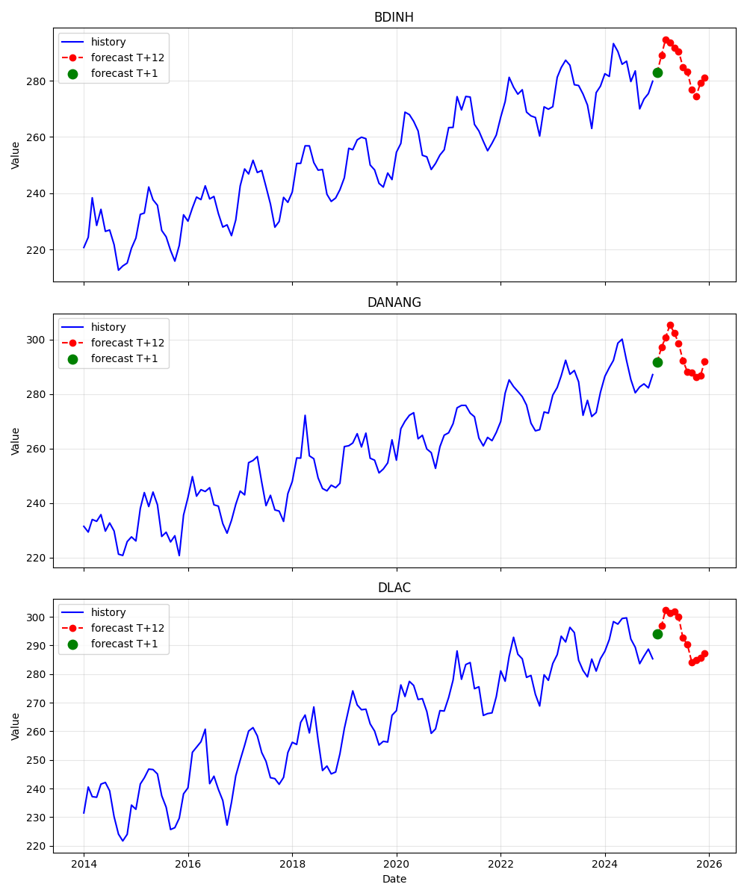
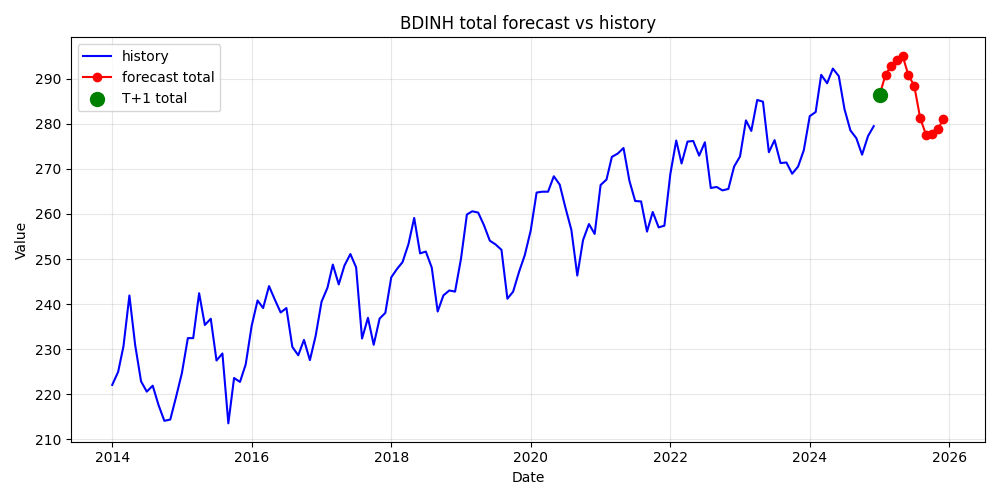
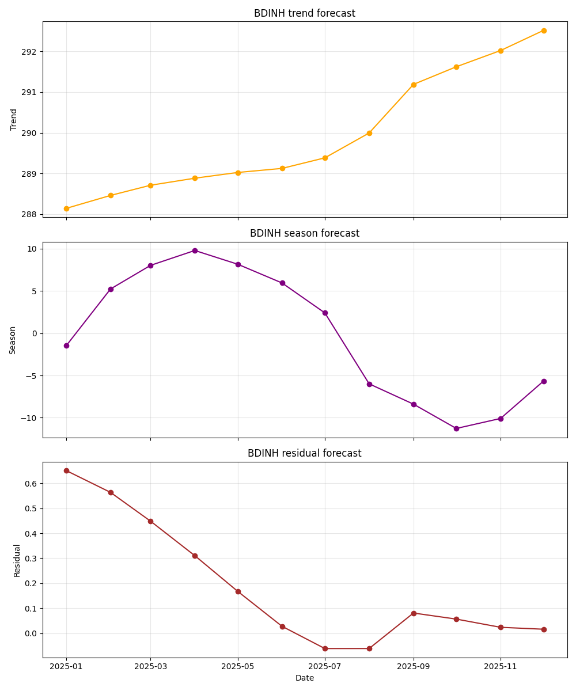

# Electricity Consumption Forecasting

> **Note:** This repository was revised from an internal project at a previous company (CADS - FPT) and cleaned for portfolio sharing. The demo uses synthetic data for illustration only; real electricity consumption data is not included.

## Highlights

- **13 provinces** across Central Vietnam — province-level monthly electricity consumption forecasting
- **< 6% MAPE** across all 13 provinces; **< 4% MAPE** for 6 of 13 — evaluated over 18 months
- **Decomposition-based approach** — trend (linear), seasonality (statistical model), and residual (ARIMA) modeled independently then combined
- **Per-month parameter tuning** — each calendar month uses an independently optimized parameter set (lag, order1, order2, shift)
- **Dual forecast horizons** — next-month (T+1) and recursive 12-month (T+12) predictions
- **Breakdown forecasting** — sub-series analysis by district and industry sector validated against total-consumption baseline

---

## Demo



A self-contained demo (`demo_prediction.py`) illustrates the full pipeline using synthetic data:

```bash
python3 demo_prediction.py
```

The demo generates component-level forecasts and saves:

| Output | Description |
|---|---|
| `docs/demo_forecast_next_month.csv` | T+1 forecast with trend, seasonal, residual, and final prediction |
| `docs/demo_forecast_12_months.csv` | Recursive T+12 forecast with component breakdown |
| `docs/forecast_sample.png` | Combined plot — history + predictions for example provinces |
| `docs/forecast_<province>.png` | Individual province-level forecast plots |

### Forecast Decomposition — BDINH Province

The model separates each province's consumption into three interpretable components:

**Total forecast vs. historical:**



**Component breakdown (trend + seasonal + residual):**



---

## Results

*Evaluation period: January 2022 – July 2023 (18 months) · 13 provinces · Data from 2014–2023*

### Overall Performance

| Metric | Result |
|---|---|
| **Primary metric** | MAPE (Mean Absolute Percentage Error) |
| **All 13 provinces** | Average MAPE **< 6%** |
| **6 of 13 provinces** | Average MAPE **< 4%** |
| **3 provinces** | Near the 6% threshold (DANANG 5.8%, DNONG 5.4%, QNGAI 5.5%) |

### Performance Groups

Provinces fell into two groups based on error stability:

| Group | Provinces | Characteristics | Action |
|---|---|---|---|
| **Group 1** | BINHDINH, GIALAI, KHANHHOA, KOMTUM, PHUYEN, QUANGNAM, QUANGBINH, QUANGTRI, TTHUE | Stable, low error (1.7–4.6% mean absolute error) | Monitor |
| **Group 2** | DANANG, DAKLAK, DAKNONG, QUANGNGAI | Higher variance, less stable (5.1–6.4% mean) | Active treatment |


### Sub-Series Breakdown Analysis

Beyond total-consumption forecasting, the model was evaluated on decomposed sub-series:

**By Industry Sector (NN_LV1):**

| Sector | Performance |
|---|---|
| Residential (Sinh hoạt dân dụng) | **Best** — 2.5–8.9% MAPE, stable |
| Other activities | **Good** — low and stable error |
| Industry & Construction | Moderate — mostly <10% (except DLAK, DNONG) |
| Agriculture, Forestry, Fishery | **High** — 15–20% MAPE, volatile (esp. Central Highlands) |
| Commerce, Hotels, Restaurants | **Highest** — 15–20%+, most volatile across all provinces |

**By District (DVDC_LV3):**

- **~65%** of district-level sub-series achieved **< 10% MAPE**
- Total-consumption forecasting vs. sum-of-sub-series forecasting produced comparable results — validating the decomposition approach
- District-level breakdown was selected as the preferred direction for deployment due to more uniform error distribution

### T+12 Recursive Forecasting

*Evaluation period: December 2022 – July 2023 (8 months)*

- T+1 error: **~6%** → T+12 error: **~14%**
- Error increases gradually with horizon distance — expected for recursive strategy
- Four strategies evaluated: Recursive, Multi-output, Direct, DirRec — **Recursive** chosen for simplicity and acceptable error propagation

---

## Problem & Approach

**Goal:** Forecast monthly electricity consumption at the province level for 13 Central Vietnam provinces using historical data from 2014 onward.

**Client:** CPC (Central Power Corporation) — a major regional electricity utility

### Core Idea: Decomposition Forecasting

Each province's monthly consumption series is decomposed into three independent components, forecast separately, then recombined:

```
Final Prediction = Trend Forecast + Seasonal Forecast + Residual Forecast
```

| Component | What it captures | Model |
|---|---|---|
| **Trend** | Long-term growth, decline, or stability | Linear model |
| **Seasonal** | Repeated monthly and yearly cycles | Statistical model with per-month parameters |
| **Residual** | Short-term variation unexplained by trend or seasonality | ARIMA |

### 1. Trend — Linear Model

Captures the underlying direction of each province's consumption. Simple and robust — avoids overfitting to short-term noise.

### 2. Seasonality — Statistical Model

The most heavily engineered component. Uses historical consumption and cumulative consumption to estimate the next month's value. A key insight from the project: **cumulative consumption patterns are highly correlated across years (correlation ≈ 1)**, making cumulative forecasting a reliable anchor.

Parameters tuned independently for each calendar month (January–December):

| Parameter | Role |
|---|---|
| `lag` | Number of historical months used for estimation (range: 3–12) |
| `order1` | Function order for monthly consumption estimation (max: 5) |
| `order2` | Function order for cumulative consumption estimation |
| `shift` | Steps to shift historical data backward (pattern matching) |

Parameter selection: grid search over parameter space, selecting the combination with lowest MAPE on the training set (2014–2021). A critical finding: **identifying which past year's pattern the forecast year most resembles is more important than parameter tuning** — correlation-based year matching was used for provinces like DANANG.

### 3. Residual — ARIMA

Captures remaining short-term patterns after trend and seasonality are removed. Added in Version 4 of the pipeline — prior versions assumed residual = 0.

### Recursive T+12 Forecasting

For multi-month horizons, the model chains one-step predictions:

```
Predict T+1 → feed into input → predict T+2 → ... → predict T+12
```

Four strategies were evaluated (Recursive, Multi-output, Direct, DirRec). Recursive was selected — error propagation is acceptable (~6% → ~14% over 12 steps) and only one model needs to be maintained.

---

## Quick Start

```bash
# Install dependencies
pip install -r requirements.txt

# Run the demo (synthetic data, no setup needed)
python3 demo_prediction.py
```

### Running on real data

```bash
# T+1 forecast (next month)
python main/forecast_t1_13pr_sum.py \
  -f 01/2023 -t 03/2023 \
  -p /path/to/params \
  -i /path/to/input.parquet \
  -o /path/to/output_t1.parquet

# T+12 forecast (next 12 months)
python main/forecast_t12_13pr_sum.py \
  -f 01/2023 -t 03/2023 \
  -p /path/to/params \
  -i /path/to/input.parquet \
  -o /path/to/output_t12.parquet
```

| Argument | Description |
|---|---|
| `-f` | Start month (`MM/YYYY`) |
| `-t` | End month (`MM/YYYY`) |
| `-p` | Parameter file for 13 provinces |
| `-i` | Input electricity data (CSV or Parquet) |
| `-o` | Output path for forecast results |

### Input Data Format

| Column | Description |
|---|---|
| `Date` | Observation month (`YYYY-MM-DD` recommended) |
| `Province` | Province name |
| `Consumption` | Electricity consumption value |

### Output

T+1 results include `Province`, `Year`, `Month`, `y_tr` (actual), and `y_pr` (predicted). T+12 results include columns `y_pr1` through `y_pr12` for each forecast horizon.

---

## Project Structure

```text
.
├── demo_prediction.py                  # Self-contained demo (synthetic data)
├── demo_forecast_next_month.csv        # T+1 demo output
├── demo_forecast_12_months.csv         # T+12 demo output
├── requirements.txt
├── docs/                               # Generated forecast plots
├── jupyter-notebook/
│   └── CPC_Forecast.ipynb              # Interactive forecasting notebook
└── main/
    ├── forecast_t1_13pr_sum.py         # T+1 forecasting script
    ├── forecast_t12_13pr_sum.py        # T+12 recursive forecasting script
    └── helper.py                       # Shared utilities
```

---

## Notes

- Update input data paths before each forecast run.
- T+12 uses recursive forecasting — errors compound over longer horizons (~6% at T+1 → ~14% at T+12).
- The statistical model depends heavily on matching the forecast year to a historically similar year; correlation-based year selection is critical for accuracy.
- Cross-province data pooling was tested but did not improve results — each province has distinct consumption patterns.
- This repository was revised from original internal project code; internal paths and data have been removed.
